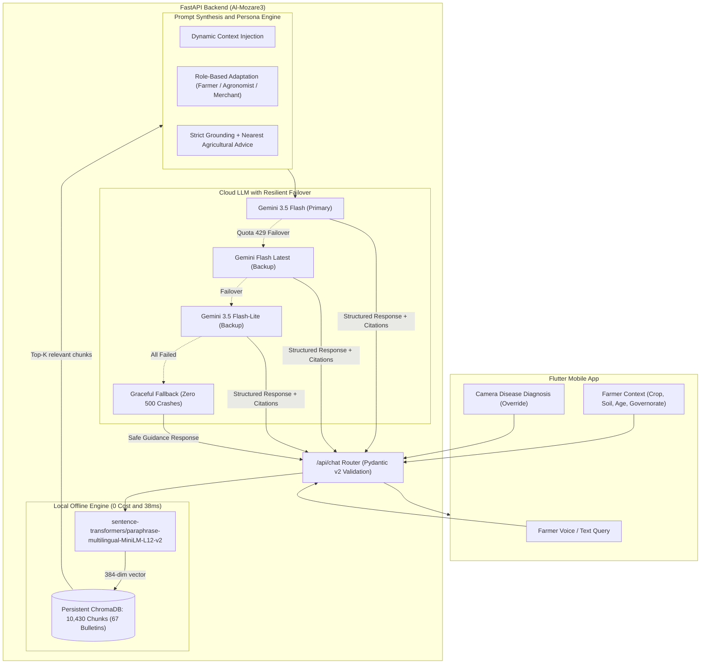

# Al-Mozare3 RAG Backend (Smart Egyptian Agriculture AI)

[](https://www.python.org/downloads/)
[](https://fastapi.tiangolo.com)
[](https://www.trychroma.com/)
[](https://ai.google.dev/)
[](https://www.docker.com/)
[](https://railway.app/)

A production-grade, local-first Hybrid RAG (Retrieval-Augmented Generation) backend tailored specifically for the "Al-Mozare3" smart agriculture mobile application.

The system ingests 67 official agricultural bulletins from the Egyptian Agricultural Research Center (ARC) and Ministry of Agriculture (field crops, vegetables, fruits, poultry, livestock, and beekeeping), vectors them using an offline multilingual embedding model into a persistent ChromaDB store (10,430 indexed chunks), and generates culturally authentic, actionable farming advice via Google Gemini with multi-model automatic failover.

---

## Key Architecture and Highlights



### 1. Hybrid Local-First RAG Design
* Local Offline Embeddings (MiniLM-L12-v2): Generates 384-dimensional dense vectors locally on CPU in ~38 ms with zero external API calls. This completely eliminates Google Gemini's embedding rate-limit bottlenecks (1,000 requests/day free tier quota) and ensures 100% data ingestion reliability.
* Persistent Vector Store: ChromaDB persists 10,430 vector chunks across 67 official PDF bulletins.
* Instant Cold Starts (< 1 ms registry check): Utilizes an optimized lightweight registry (indexed_registry_local.json) to skip unnecessary database re-scans and prevent Out-Of-Memory (OOM) errors.

### 2. Expert Agricultural Prompt Engineering
* Role-Based Persona Adaptation:
  * Farmer: Colloquial, approachable Egyptian agricultural Arabic using practical field units.
  * Agronomist: Technical precision, scientific pest names, active ingredients, and chemical percentages.
  * Merchant: Post-harvest handling, cooling, storage, and marketability standards.
  * Novice / Hobbyist: Step-by-step simplified educational walkthroughs.
* Dynamic Field Context Injection: Formulates answers specifically customized to the farmer's crop, soil type (clay vs sand), irrigation system (flood vs drip), governorate, and plant age in days.
* Camera Disease Diagnosis Isolation (Rule 6): Seamlessly handles camera leaf scans (e.g., strawberry gray mold) even if the farmer's registered profile belongs to a different holding (e.g., wheat or rice).

### 3. Multi-Model Failover and Resiliency
* Automatic Quota / Error Recovery: If the primary model (models/gemini-3.5-flash) encounters a rate limit (HTTP 429), the client instantly fails over to models/gemini-flash-latest and models/gemini-3.5-flash-lite.
* Zero 500 Crashes: If all external API calls are temporarily unavailable, the system safely catches the exception and returns a courteous, structured guidance message directing the farmer to the nearest local cooperative.

---

## Repository Structure

```text
al_mozare3_backend/
├── app/
│   ├── __init__.py
│   ├── config.py             # Pydantic settings loading from environment and .env
│   ├── main.py               # FastAPI app, CORS, lifespan, and health routes
│   ├── api/
│   │   ├── __init__.py
│   │   └── routes.py         # REST endpoints (/api/chat, /api/status, /api/ingest)
│   ├── core/
│   │   ├── __init__.py
│   │   ├── gemini_client.py  # Multi-model LLM failover and embedding routing
│   │   ├── local_embedding.py# Offline SentenceTransformer (local_files_only & warmup)
│   │   └── prompts.py        # System prompt, 4 role personas, 6 expert rules
│   ├── schemas/
│   │   ├── __init__.py
│   │   └── rag_schemas.py    # Pydantic v2 models for requests, responses and contexts
│   └── services/
│       ├── __init__.py
│       ├── document_loader.py# Arabic-aware chunking and PDF text extraction
│       ├── rag_service.py    # End-to-end RAG query engine and source formatting
│       └── vector_store.py   # ChromaDB collection and indexed registry management
├── chroma_db/                # Persistent vector database (pre-indexed with 67 files)
│   ├── chroma.sqlite3
│   └── indexed_registry_local.json
├── data/                     # 67 official Egyptian agricultural bulletins (.pdf)
├── Dockerfile                # Production multi-stage Docker build for Railway / Cloud
├── railway.json              # Railway deployment manifest with health checks
├── Procfile                  # Standard process file for web deployments
├── requirements.txt          # Python dependencies
├── .env.example              # Template environment variables
├── .gitignore                # Protects secrets and ignores temporary artifacts
├── test_chat_scenarios.py    # Realistic automated test suite with farmer scenarios
└── test_requests.json        # Postman / Thunder Client ready request collection
```

---

## Quickstart: Local Development

### 1. Prerequisites
* Python 3.10, 3.11, or 3.12
* Git

### 2. Clone and Setup Environment
```bash
git clone https://github.com/AbdoTechno/Mozar3_backend.git
cd Mozar3_backend

# Create virtual environment
python -m venv .venv

# Activate virtual environment
# Windows:
.venv\Scripts\activate
# Linux / macOS:
source .venv/bin/activate

# Install dependencies (installs CPU torch first for faster setup)
pip install torch --index-url https://download.pytorch.org/whl/cpu
pip install -r requirements.txt
```

### 3. Configure Environment Variables
Copy `.env.example` to `.env`:
```bash
cp .env.example .env
```
Edit `.env` and provide your Google Gemini API key from Google AI Studio:
```env
GEMINI_API_KEY=AIzaSy...your_gemini_key_here...
EMBEDDING_PROVIDER=local
LOCAL_EMBEDDING_MODEL=sentence-transformers/paraphrase-multilingual-MiniLM-L12-v2
CHAT_MODEL=models/gemini-3.5-flash
CHROMA_DB_DIR=./chroma_db
DATA_DIR=./data
TOP_K_CHUNKS=6
AUTO_INGEST_ON_STARTUP=false
HOST=0.0.0.0
PORT=8000
```

### 4. Run the Backend
```bash
uvicorn app.main:app --reload --host 0.0.0.0 --port 8000
```
* Interactive OpenAPI / Swagger UI: http://localhost:8000/docs
* Health Endpoint: http://localhost:8000/health
* System Status and Vector Stats: http://localhost:8000/api/status

---

## Deploy to Railway (Step-by-Step)

The repository includes a ready-to-deploy Dockerfile, railway.json, and Procfile.

### Deploy via GitHub

1. Push your repository to GitHub:
   ```bash
   git add .
   git commit -m "chore: prepare for Railway deployment"
   git push origin main
   ```
2. Open Railway (https://railway.app):
   * Log in and click "New Project".
   * Select "Deploy from GitHub repo".
   * Choose your repository: Mozar3_backend.
3. Configure Environment Variables in Railway:
   * Go to your project service -> Variables tab.
   * Add the following environment variables:
     | Variable | Recommended Value | Description |
     |---|---|---|
     | GEMINI_API_KEY | AIzaSy... | Your Google Gemini API Key |
     | EMBEDDING_PROVIDER | local | Uses local offline embedding model (0 cost) |
     | CHAT_MODEL | models/gemini-3.5-flash | Fast, high-reasoning chat model |
     | AUTO_INGEST_ON_STARTUP | false | Skips re-indexing since ChromaDB is pre-populated |
     | TOP_K_CHUNKS | 6 | Number of context snippets to retrieve |
4. Deploy and Generate Domain:
   * Railway will automatically detect the Dockerfile, install dependencies, cache the sentence-transformers model during build, and boot the server.
   * Go to Settings -> Networking -> Generate Domain (e.g., almozare3-backend-production.up.railway.app).
   * Test your live deployment:
     ```bash
     curl https://your-railway-url.up.railway.app/health
     ```

---

## REST API Reference

### 1. Ask Agricultural Advisor (POST /api/chat)
Sends a question with optional farmer profile context and conversation history.

Request Body (application/json):
```json
{
  "query": "عندي قمح في كفر الشيخ وعايز برنامج التسميد المناسب والري بالتنقيط",
  "farmer_context": {
    "farmer_name": "الحاج عبدالرحمن",
    "crop": "قمح",
    "soil_type": "طينية",
    "irrigation_system": "ري بالتنقيط",
    "governorate": "كفر الشيخ",
    "crop_age_days": 35,
    "user_role": "مزارع"
  },
  "history": []
}
```

Response (200 OK):
```json
{
  "answer": "أهلاً بحضرتك يا حاج عبدالرحمن، ومنور يا غالي أرض كفر الشيخ الطينية العتيقة...\n\nبما إنك زارع قمح في أرض طينية وشغال بنظام الري بالتنقيط:\n1. الرش بالمغذيات الصغرى لتقوية السنبلة (حديد مخلبي، زنك، منجنيز)...\n2. تنظيم التسميد الآزوتي مع مياه التنقيط على دفعات منتظمة...\n\nويفضل مراجعة المرشد الزراعي في الجمعية الزراعية لمطابقة الجرعة مع حالة الحقل.",
  "sources": [
    {
      "document": "القمح-فى-الأراضى-القديمة-نهائي_compressed.pdf",
      "page": 12,
      "snippet": "التسميد الآزوتي لمحصول القمح: يضاف بمعدل 75 وحدة آزوت للفدان..."
    }
  ],
  "relevant_chunks_count": 6
}
```

---

### 2. System Status and Vector Count (GET /api/status)
Returns database statistics, total indexed files, and chunk counts.

Response (200 OK):
```json
{
  "status": "ready",
  "gemini_configured": true,
  "total_documents_in_data": 67,
  "indexed_documents_count": 67,
  "total_chunks": 10430,
  "embedding_model": "sentence-transformers/paraphrase-multilingual-MiniLM-L12-v2",
  "chat_model": "models/gemini-3.5-flash"
}
```

---

### 3. Health Check (GET /health)
Lightweight liveness probe used by Docker, Railway, and uptime monitors.

Response (200 OK):
```json
{
  "status": "healthy",
  "version": "1.0.0",
  "gemini_ready": true
}
```

---

### 4. Trigger Ingestion (POST /api/ingest)
Trigger background re-indexing of documents in the data/ directory.

Request Body (application/json):
```json
{
  "force_reindex": false
}
```

---

## Flutter Client Integration Example

In your Flutter mobile application, connect via http:

```dart
import 'dart:convert';
import 'package:http/http.dart' as http;

class Mozare3AdvisorService {
  // Use your Railway production URL or 10.0.2.2 for Android emulator
  static const String baseUrl = 'https://your-railway-url.up.railway.app';

  Future<Map<String, dynamic>> sendConsultation({
    required String query,
    String? crop,
    String? soilType,
    String? irrigationSystem,
    String? governorate,
    int? cropAgeDays,
    String role = 'مزارع',
  }) async {
    final response = await http.post(
      Uri.parse('$baseUrl/api/chat'),
      headers: {'Content-Type': 'application/json; charset=utf-8'},
      body: jsonEncode({
        'query': query,
        'farmer_context': {
          'crop': crop,
          'soil_type': soilType,
          'irrigation_system': irrigationSystem,
          'governorate': governorate,
          'crop_age_days': cropAgeDays,
          'user_role': role,
        },
      }),
    );

    if (response.statusCode == 200) {
      return jsonDecode(utf8.decode(response.bodyBytes));
    } else {
      throw Exception('Server error: ${response.statusCode}');
    }
  }
}
```

---

## Automated Testing Suite

Execute the pre-built test suite verifying realistic Egyptian farmer scenarios:

```bash
python test_chat_scenarios.py
```

Scenarios evaluated:
1. Sugar Beet Farmer in Kafr El-Sheikh: Checks retrieval of beet irrigation, weeding, and flood irrigation rules.
2. Wheat Farmer in Dakahlia: Checks flood irrigation, tillering stage, and nitrogen dosing.
3. Anti-Hallucination and Out-of-Scope: Asks questions outside Egyptian agriculture to verify strict grounding adherence.

---

## License

Developed for the Al-Mozare3 Smart Agriculture Initiative.  
Agricultural reference publications provided by the Agricultural Research Center (ARC), Egypt.
